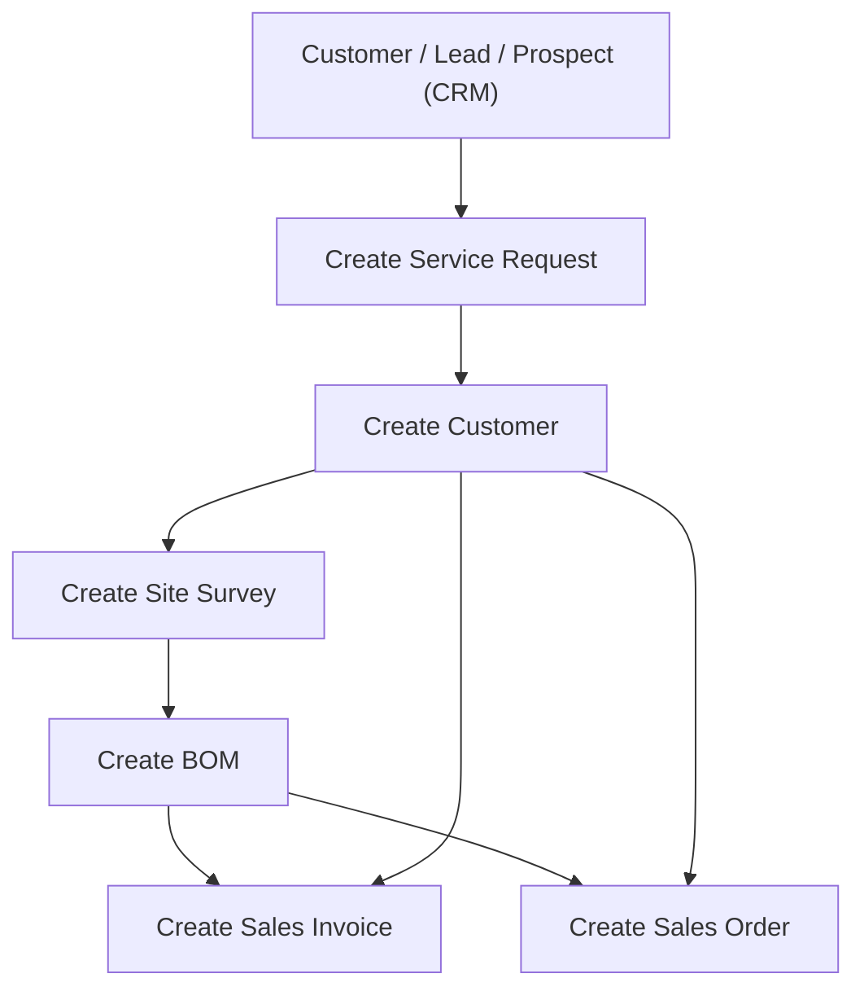
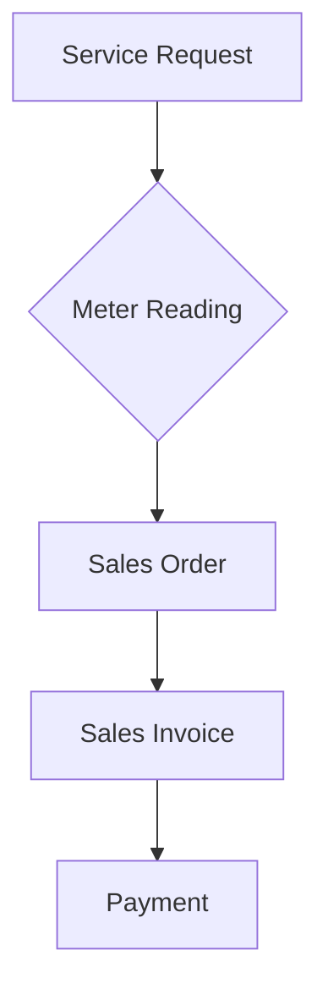

# I. 🔌 **Utility Billing**

---

### 🧩 **Main Functionalities**

### 🔌 **Utility Billing**

- 💬 Service Request Management
- 📏 Meter Reading
- 💰 Tariff Management
- 🧾 Bulk Billing (Mass Billing)

---

## 🔍 **Key Features**

---

### 🧾 **1. Utility Billing**

<h4 style="display:flex; justify-content:space-between; align-items:center;">
  🛠️ 1.1  <a href="./Utility-Billing-Settings.md">Utility Billing Settings</a>
  <a href="./Utility-Billing-Settings.md">
    <button style="background:#6f42c1; color:white; padding:6px 14px; border:none; border-radius:6px; font-size:14px; cursor:pointer;">
      👉 Explore More
    </button>
  </a>
</h4>

####

Configure utility preferences in the **Utility Settings** doctype.

  

Key Fields:

- 🔄 **Sales Order / Invoice / Stock Entry Creation State** — Choose "Draft" or "Submitted"
- 📦 **Merge Sales Orders** — One invoice per customer across multiple orders

#### 👥 1.2 Customer Grouping

- Segment customers (e.g., Residential, Commercial) for tailored billing  
  🔗 [Customer Groups](https://docs.erpnext.com/docs/user/manual/en/customer-group)

#### 💲 1.3 Price Lists & Tariffs

- Define prices based on customer type, block rates, or service tiers  
  🔗 [Price Lists](https://docs.erpnext.com/docs/user/manual/en/price-lists)

---

### 📊 **2. Billing Management**

#### ⛽ 2.1 Meter Reading

  

Steps:

1. Select Customer
2. Add Utility Item & Enter Current Reading
3. System fetches previous reading & calculates usage
4. Auto creates Sales Order on Submit

#### 📝 2.2 Service Requests

  

Flow:

1. Add Request → Survey → BOM → Sales Order
2. New Meter Numbers may be assigned during request
3. Auto-create Customer profile & meter linkage

  

  

  

#### 🧮 2.3 Mass Billing

  

Steps:

1. Select Sales Orders
2. Menu → Create Sales Invoice
3. Background job auto-generates invoices

---

### 📌 **3. Important Notes**

#### 🔧 3.1 Item Configuration

- ✅ Tick "Is Utility Item" to mark billable services

  

#### 📟 3.2 Meter Numbers

- Managed as **Serial Numbers**, assigned via **Warranty Claim**

  

---

## 📊 **Visual Process Flows**

### 🔌 **Utility Service Request Process**

> 💡 Customer can be automatically created on submit, depending on configuration in settings. **Utility Billing Settings**.

---

### 🔌 **Utility Billing Workflow**

---

### **Quick Navigation**

  <a href="https://github.com/navariltd/utility-billing" target="_blank" style="background:#E9F5DB; color:#000; padding:0.6rem 1rem; border-radius:0.5rem; text-decoration:none; font-weight:bold; display:inline-flex; align-items:center;">🏠 Home</a>
  <a href="https://github.com/navariltd/utility-billing/wiki" target="_blank" style="background:#6c5ce7; color:#fff; padding:0.6rem 1rem; border-radius:0.5rem; text-decoration:none; font-weight:bold; display:inline-flex; align-items:center;">📖 Full Documentation</a>
  <a href="https://docs.erpnext.com" target="_blank" style="background:#ff9f00; color:#fff; padding:0.6rem 1rem; border-radius:0.5rem; text-decoration:none; font-weight:bold; display:inline-flex; align-items:center;">📄 ERPNext Docs</a>
  <a href="https://frappeframework.com/docs" target="_blank" style="background:#00b894; color:#fff; padding:0.6rem 1rem; border-radius:0.5rem; text-decoration:none; font-weight:bold; display:inline-flex; align-items:center;">🧰 Frappe Framework</a>
  <a href="https://discuss.frappe.io" target="_blank" style="background:#f39c12; color:#fff; padding:0.6rem 1rem; border-radius:0.5rem; text-decoration:none; font-weight:bold; display:inline-flex; align-items:center;">🗣️ Community Forum</a>
  <a href="https://github.com/navariltd/utility-billing/issues" target="_blank" style="background:#e74c3c; color:#fff; padding:0.6rem 1rem; border-radius:0.5rem; text-decoration:none; font-weight:bold; display:inline-flex; align-items:center;">🐞 Report an Issue</a>
  <a href="https://navari.co.ke" target="_blank" style="background:#2d3436; color:#fff; padding:0.6rem 1rem; border-radius:0.5rem; text-decoration:none; font-weight:bold; display:inline-flex; align-items:center;">🌐 Website</a>

